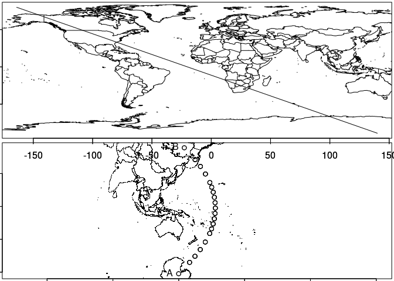
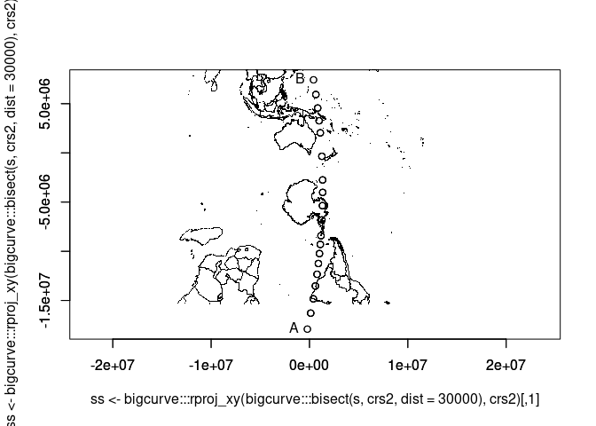

<!-- README.md is generated from README.Rmd. Please edit that file -->

# bigcurve

<!-- badges: start -->

[](https://github.com/hypertidy/bigcurve/actions)
<!-- badges: end -->

The goal of bigcurve is to adaptively densify lines. Like D3’s Flawed
Example by Mike Bostock.

todo

- [ ] speed up
- [ ] consider remove terra
- [x] remove geosphere
- [ ] make helpers for various formats

Get in touch if you’re interested! Post [an issue to
discuss](https://github.com/hypertidy/bigcurve/issues) or ping me [on
fedi](https://fosstodon.org/@mdsumner).

## Installation

You can install the development version of bigcurve like so:

``` r
devtools::install_github("hypertidy/bigcurve")
```

## Example

This is a basic example which shows you how to solve a common problem.

What’s the point? We get *just enough* points to carry the curvature of
our line from point A to point B (shown in the longlat map) over the
shortest distance.

The `dist` argument controls the minimum distance, but be aware this is
very slow and flaky for now.

``` r
library(bigcurve)
#> The legacy packages maptools, rgdal, and rgeos, underpinning this package
#> will retire shortly. Please refer to R-spatial evolution reports on
#> https://r-spatial.org/r/2023/05/15/evolution4.html for details.
#> This package is now running under evolution status 0
s <- segment(c(140, -164), c(-89, 80))
#crs <- laea(runif(1, -180, 180), runif(1, -90, 90))
#crs <- "+proj=omerc +lon_0=147 +lonc = 180 +gamma=10 +lat_0=-42"
crs <- "+proj=tmerc +lon_0=147 +lat_0=-42"
op <- par(mfrow = c(2, 1), mar = rep(0.2, 4))
m <- do.call(cbind, maps::map(plot = FALSE)[1:2])
plot(s, type = "l");lines(m);axis(1);axis(2); text(s[[1]], lab = c("A", "B"), pos = 2)
plot(ss <- bigcurve:::rproj_xy(bigcurve:::bisect(s, crs, dist = 3e4), crs), asp = 1)
points(bigcurve:::rproj_xy(m, crs), pch = ".")
axis(1);axis(2)
points(ss)
text(ss[c(1, nrow(ss)),], c("A", "B"), pos = 2)
```



``` r
par(op)
```

If we take that same path (A to B, shortest distance) in a different
projection we get the *same path* but at different locations, because
the curvature is a different situation here.

``` r
crs2 <- "+proj=stere +lon_0=180 +lat_0=20"
plot(ss <-bigcurve:::rproj_xy(bigcurve:::bisect(s, crs2, dist = 3e4), crs2), asp = 1)

points(bigcurve:::rproj_xy( m, crs), pch = ".")
axis(1);axis(2)
points(ss)
text(ss[c(1, nrow(ss)), ], c("A", "B"), pos = 2)
```



The proper source of goodness is here:

<https://bost.ocks.org/mike/example/>

------------------------------------------------------------------------

## Code of Conduct

Please note that the bigcurve project is released with a [Contributor
Code of
Conduct](https://contributor-covenant.org/version/2/0/CODE_OF_CONDUCT.html).
By contributing to this project, you agree to abide by its terms.
